# Unity Universal Render Pipeline (URP) - Architecture Diagrams

## 1. Overall URP Architecture Diagram

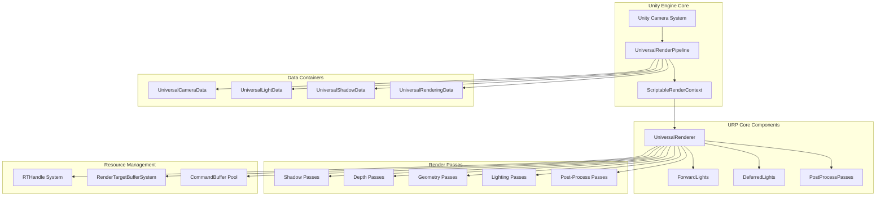

## 2. URP Class Hierarchy Diagram

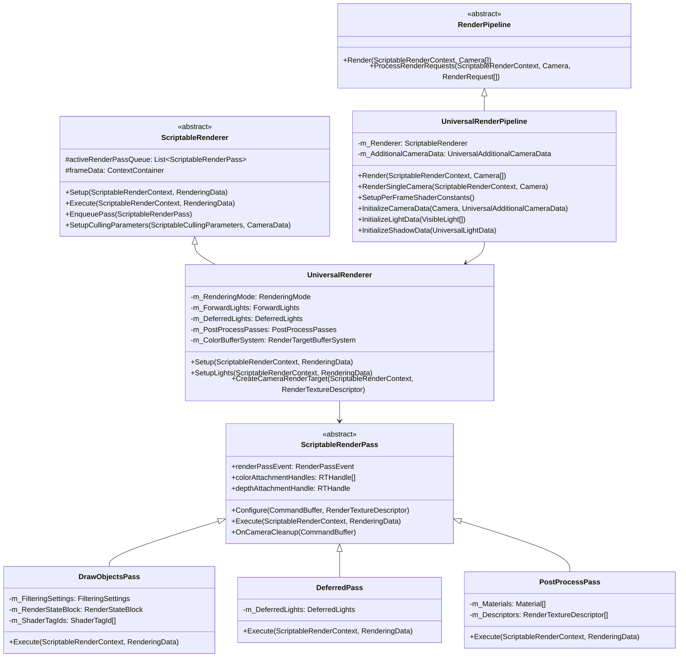

## 3. Data Flow Architecture

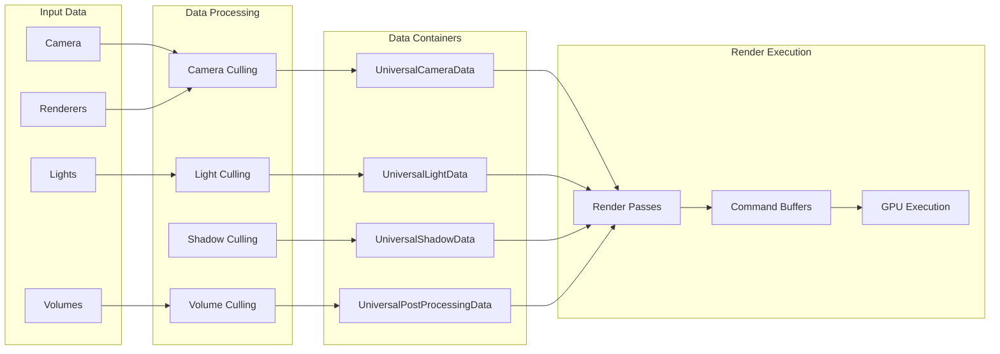

## 4. Rendering Mode Architecture

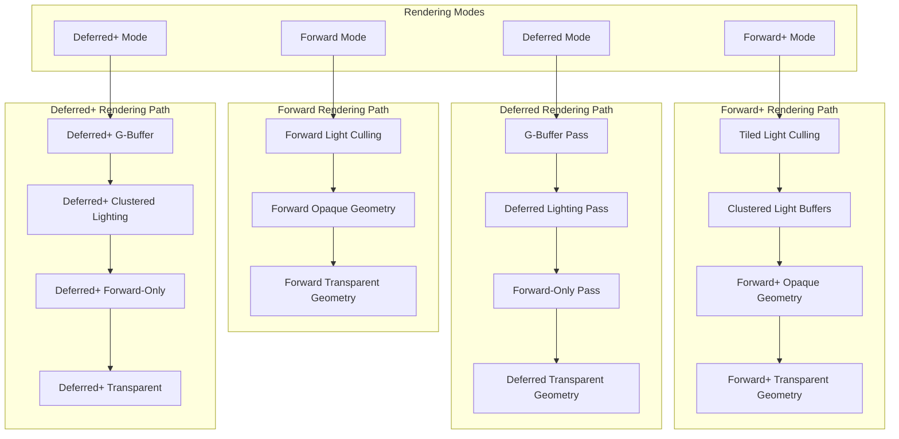

## 5. Forward Lighting System Diagram

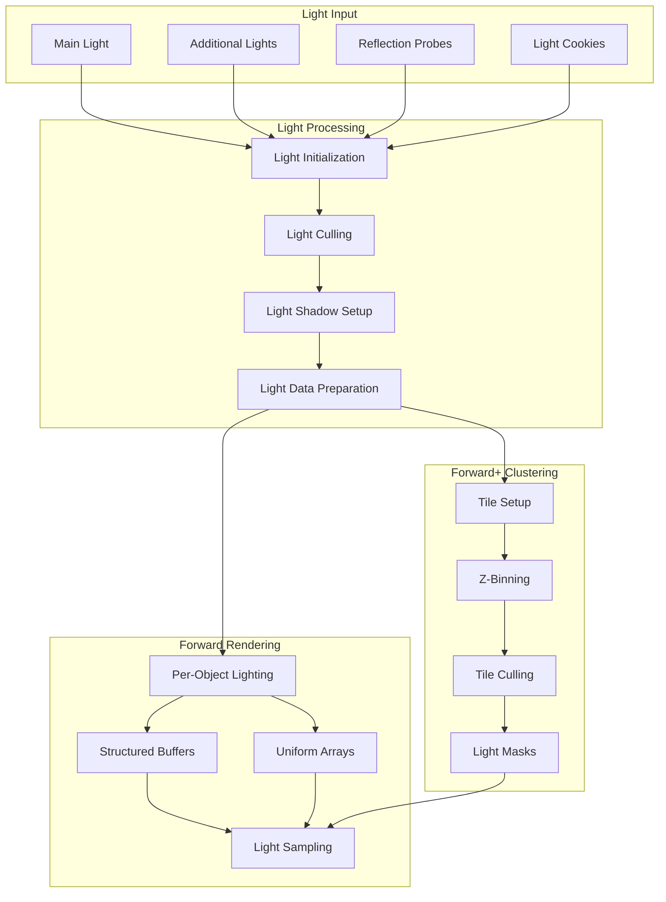

## 6. Deferred Rendering G-Buffer Layout

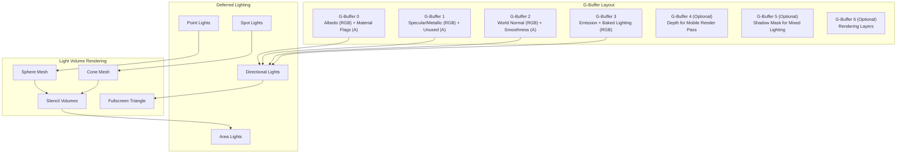

## 7. Render Pass Execution Flow

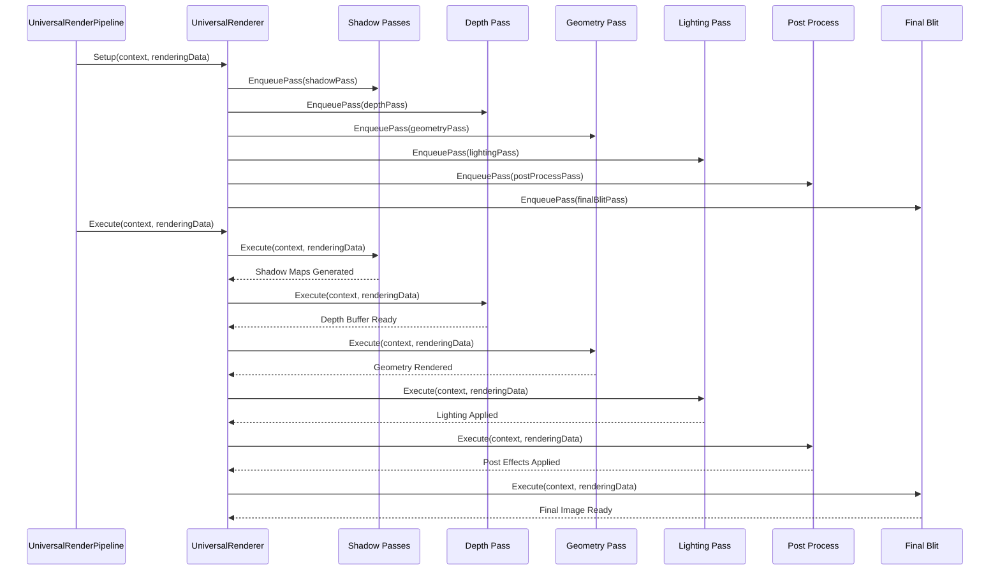

## 8. Resource Management System

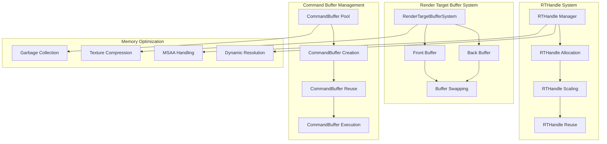

## 9. Post-Processing Pipeline

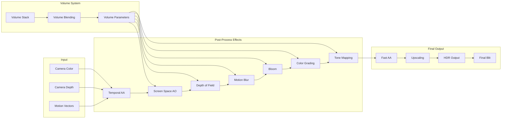

## 10. XR/VR Rendering Architecture

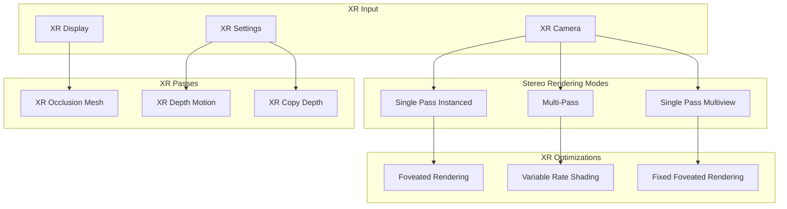

## 11. Shader Integration Architecture

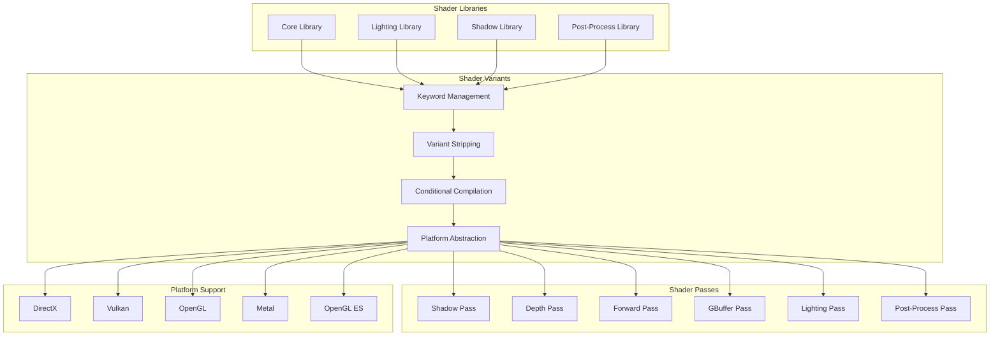

## 12. Performance Optimization Systems

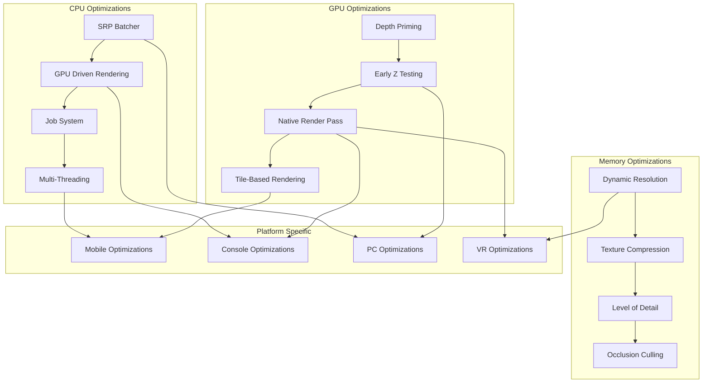

These diagrams provide a comprehensive visual representation of Unity's URP architecture, showing the relationships between components, data flow, and execution patterns. Each diagram focuses on a specific aspect of the pipeline while maintaining connections to the overall system architecture.