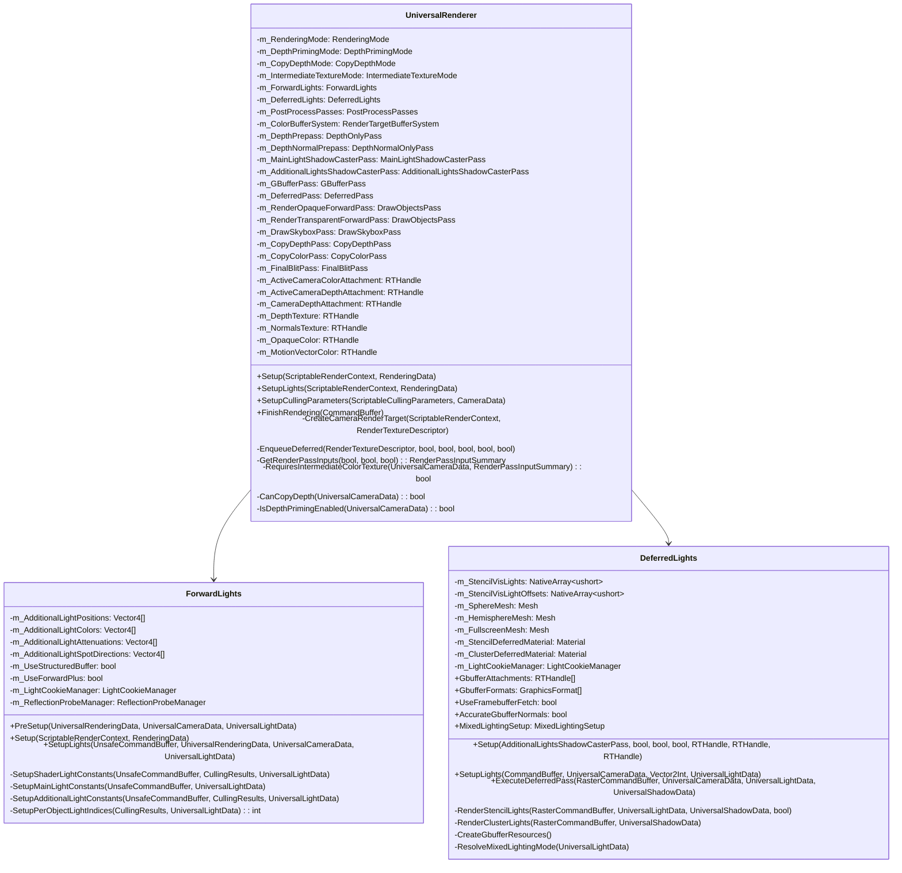
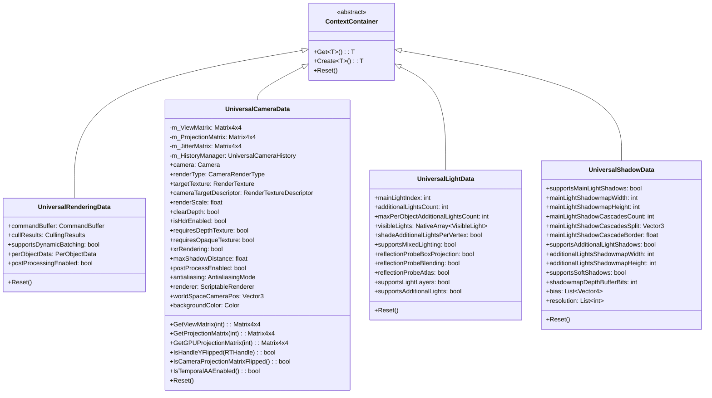
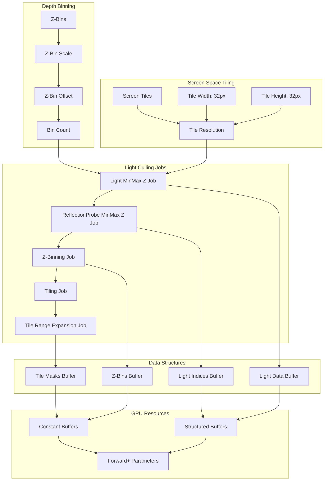
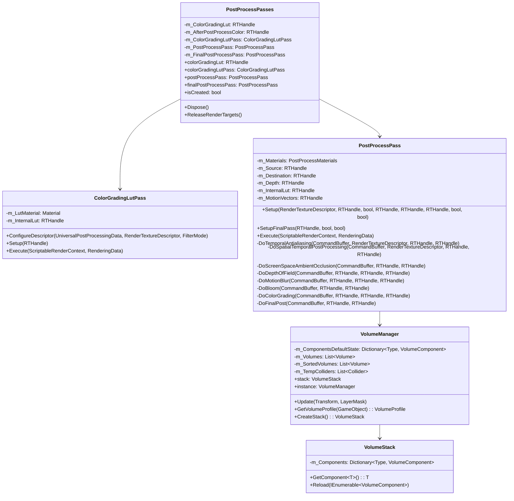
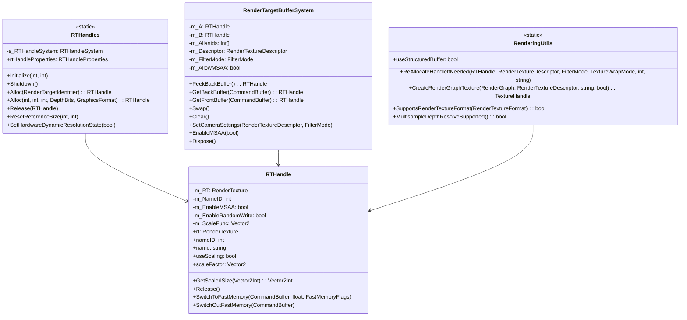
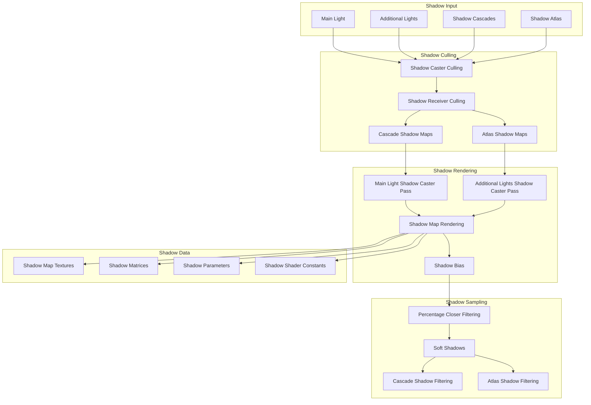
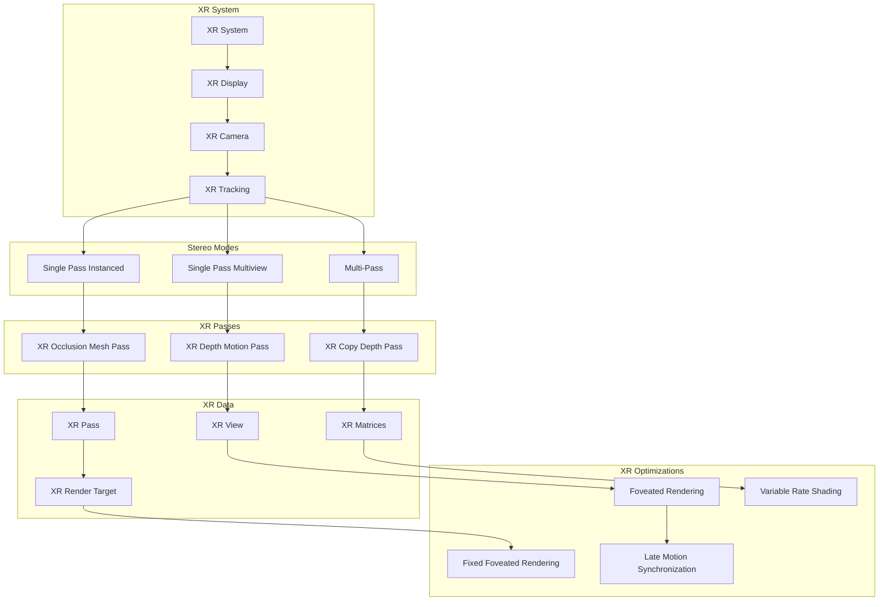
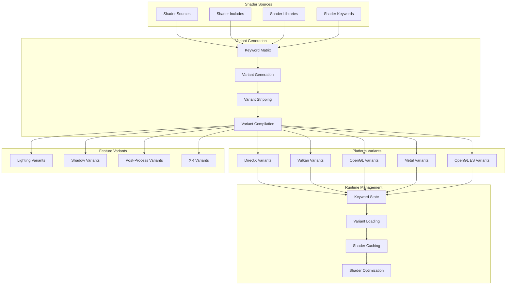
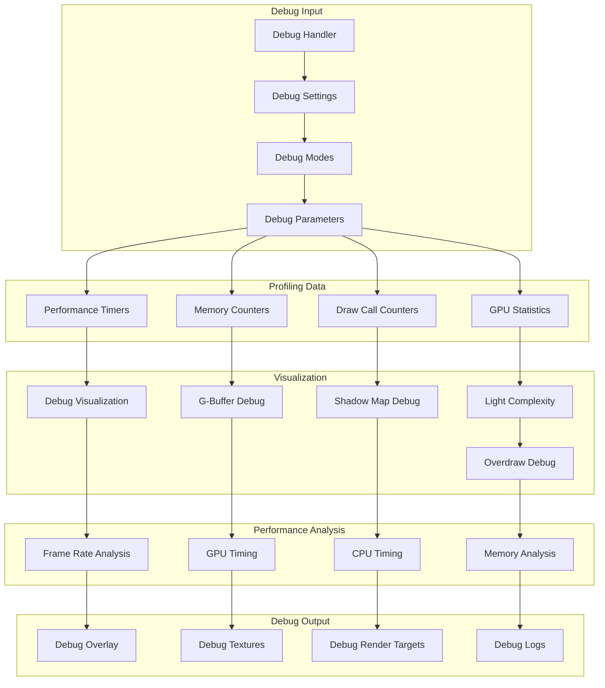

# Unity URP - Detailed Component Diagrams

## 1. UniversalRenderer Component Breakdown

## 2. Data Container Relationships

## 3. Render Pass Hierarchy and Execution

```mermaid
classDiagram
    class ScriptableRenderPass {
        <<abstract>>
        +renderPassEvent: RenderPassEvent
        +colorAttachmentHandles: RTHandle[]
        +depthAttachmentHandle: RTHandle
        +input: ScriptableRenderPassInput
        +clearFlag: ClearFlag
        +clearColor: Color
        +requiresIntermediateTexture: bool
        
        +ConfigureInput(ScriptableRenderPassInput)
        +ConfigureTarget(RTHandle, RTHandle)
        +ConfigureClear(ClearFlag, Color)
        +Configure(CommandBuffer, RenderTextureDescriptor)
        +Execute(ScriptableRenderContext, RenderingData)
        +OnCameraCleanup(CommandBuffer)
        +RecordRenderGraph(RenderGraph, ContextContainer)
    }
    
    class DepthOnlyPass {
        -m_FilteringSettings: FilteringSettings
        -m_ShaderTagIds: ShaderTagId[]
        
        +Setup(RenderTextureDescriptor, RTHandle)
        +Execute(ScriptableRenderContext, RenderingData)
    }
    
    class DepthNormalOnlyPass {
        -m_FilteringSettings: FilteringSettings
        -m_ShaderTagIds: ShaderTagId[]
        -m_DecalLayersTexture: RTHandle
        
        +Setup(RTHandle, RTHandle)
        +Setup(RTHandle, RTHandle, RTHandle)
        +Execute(ScriptableRenderContext, RenderingData)
    }
    
    class DrawObjectsPass {
        -m_FilteringSettings: FilteringSettings
        -m_RenderStateBlock: RenderStateBlock
        -m_ShaderTagIds: ShaderTagId[]
        -m_IsOpaque: bool
        
        +Execute(ScriptableRenderContext, RenderingData)
        -RenderBlock(ScriptableRenderContext, CommandBuffer, CullingResults, DrawingSettings, FilteringSettings, RenderStateBlock)
    }
    
    class GBufferPass {
        -m_FilteringSettings: FilteringSettings
        -m_RenderStateBlock: RenderStateBlock
        -m_ShaderTagIds: ShaderTagId[]
        -m_DeferredLights: DeferredLights
        
        +Execute(ScriptableRenderContext, RenderingData)
        +Dispose()
    }
    
    class DeferredPass {
        -m_DeferredLights: DeferredLights
        
        +Execute(ScriptableRenderContext, RenderingData)
    }
    
    class MainLightShadowCasterPass {
        -m_MainLightShadowmapTexture: RTHandle
        -m_MaxShadowDistanceSq: float
        -m_CascadeSplitDistances: Vector4
        -m_ShadowCasterCascadesCount: int
        
        +Setup(UniversalRenderingData, UniversalCameraData, UniversalLightData, UniversalShadowData): bool
        +Execute(ScriptableRenderContext, RenderingData)
        -SetupMainLightShadowReceiverConstants(CommandBuffer, VisibleLight, bool)
        -RenderMainLightCascadeShadowmap(ScriptableRenderContext, CommandBuffer, int, Matrix4x4, float, float)
    }
    
    class AdditionalLightsShadowCasterPass {
        -m_AdditionalLightsShadowmapHandle: RTHandle
        -m_AdditionalShadowsBufferId: int
        -m_AdditionalShadowsIndicesId: int
        -m_ShadowAtlasLayout: AdditionalLightsShadowAtlasLayout
        
        +Setup(UniversalRenderingData, UniversalCameraData, UniversalLightData, UniversalShadowData): bool
        +Execute(ScriptableRenderContext, RenderingData)
        +GetShadowLightIndexFromLightIndex(int): int
        -RenderAdditionalShadowmapAtlas(ScriptableRenderContext, CommandBuffer, int, VisibleLight[], List~int~)
    }
    
    ScriptableRenderPass <|-- DepthOnlyPass
    ScriptableRenderPass <|-- DepthNormalOnlyPass
    ScriptableRenderPass <|-- DrawObjectsPass
    ScriptableRenderPass <|-- GBufferPass
    ScriptableRenderPass <|-- DeferredPass
    ScriptableRenderPass <|-- MainLightShadowCasterPass
    ScriptableRenderPass <|-- AdditionalLightsShadowCasterPass
```

## 4. Forward+ Clustering System

## 5. Post-Processing System Architecture

## 6. RTHandle and Resource Management

## 7. Shadow System Architecture

## 8. XR/VR Rendering Pipeline

## 9. Shader Variant System

## 10. Performance Profiling and Debug System

These detailed component diagrams provide an in-depth view of Unity URP's internal architecture, showing the relationships between classes, data flow patterns, and system interactions at a granular level. Each diagram focuses on specific subsystems while maintaining connections to the broader architecture.