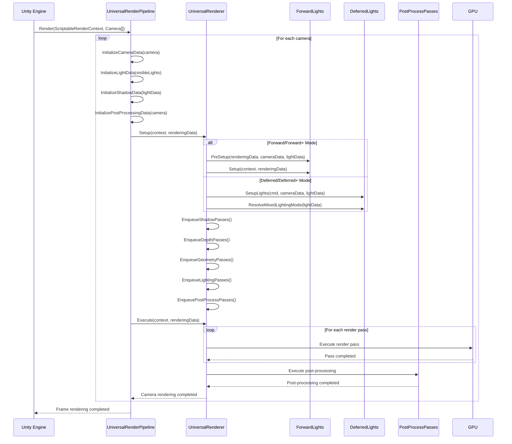
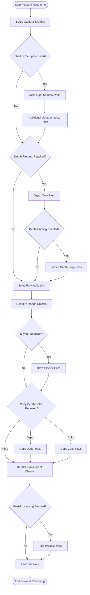
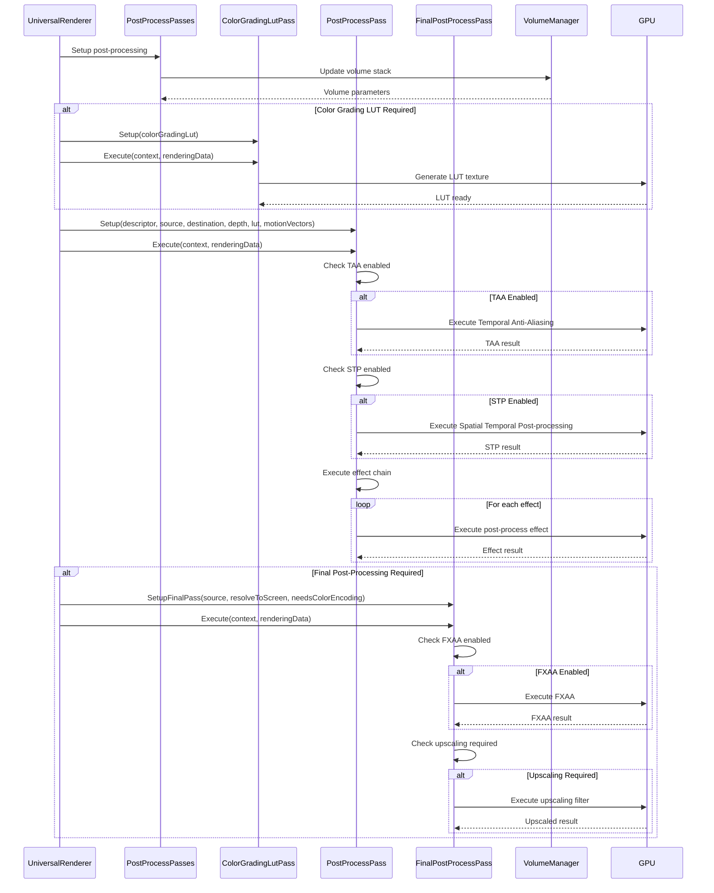
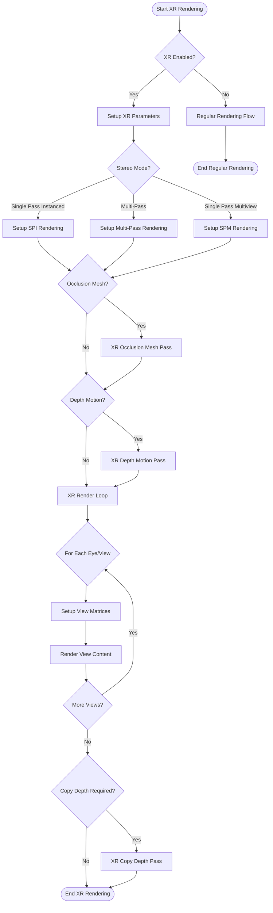
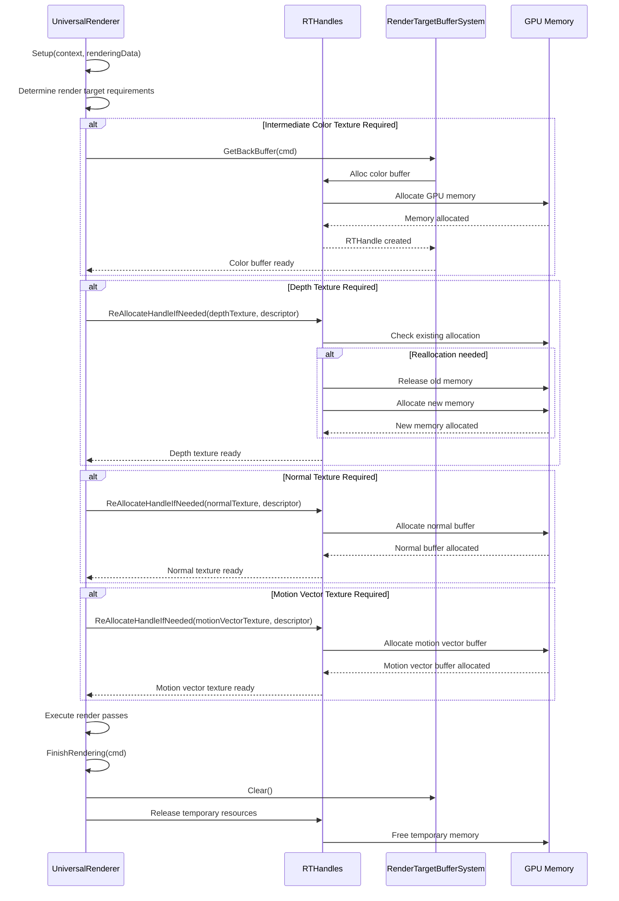
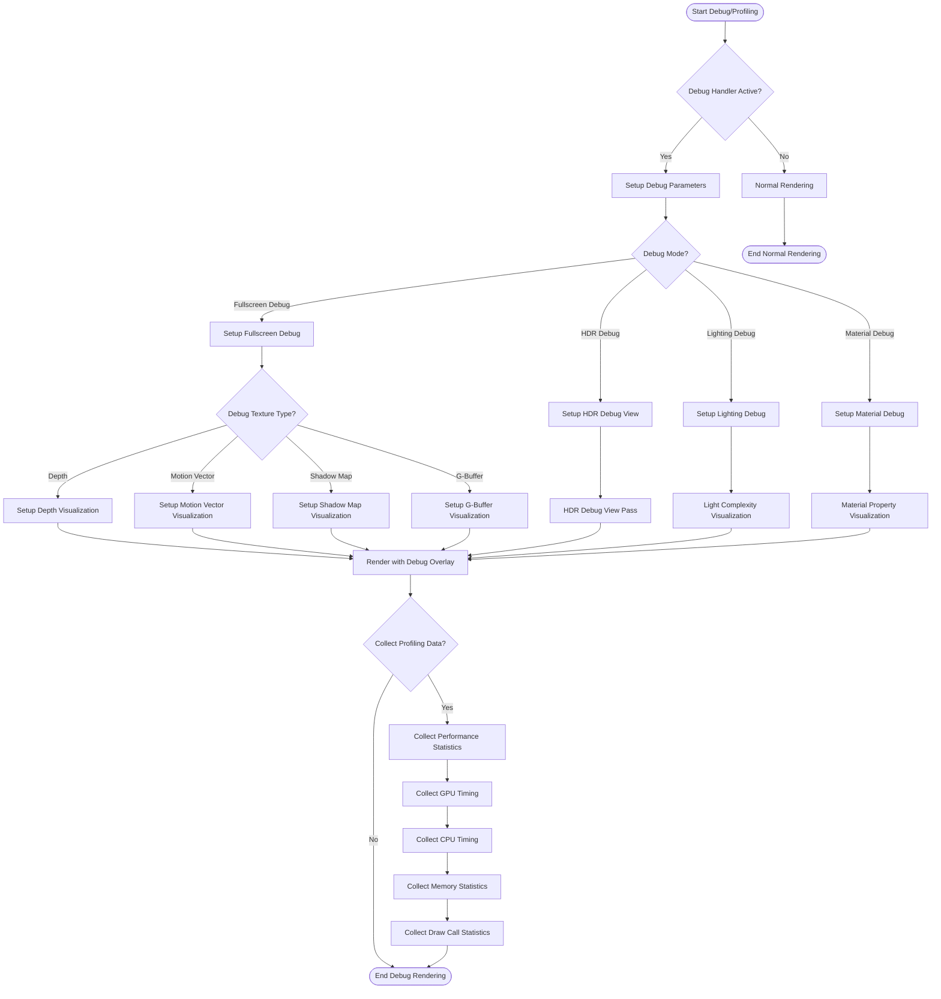
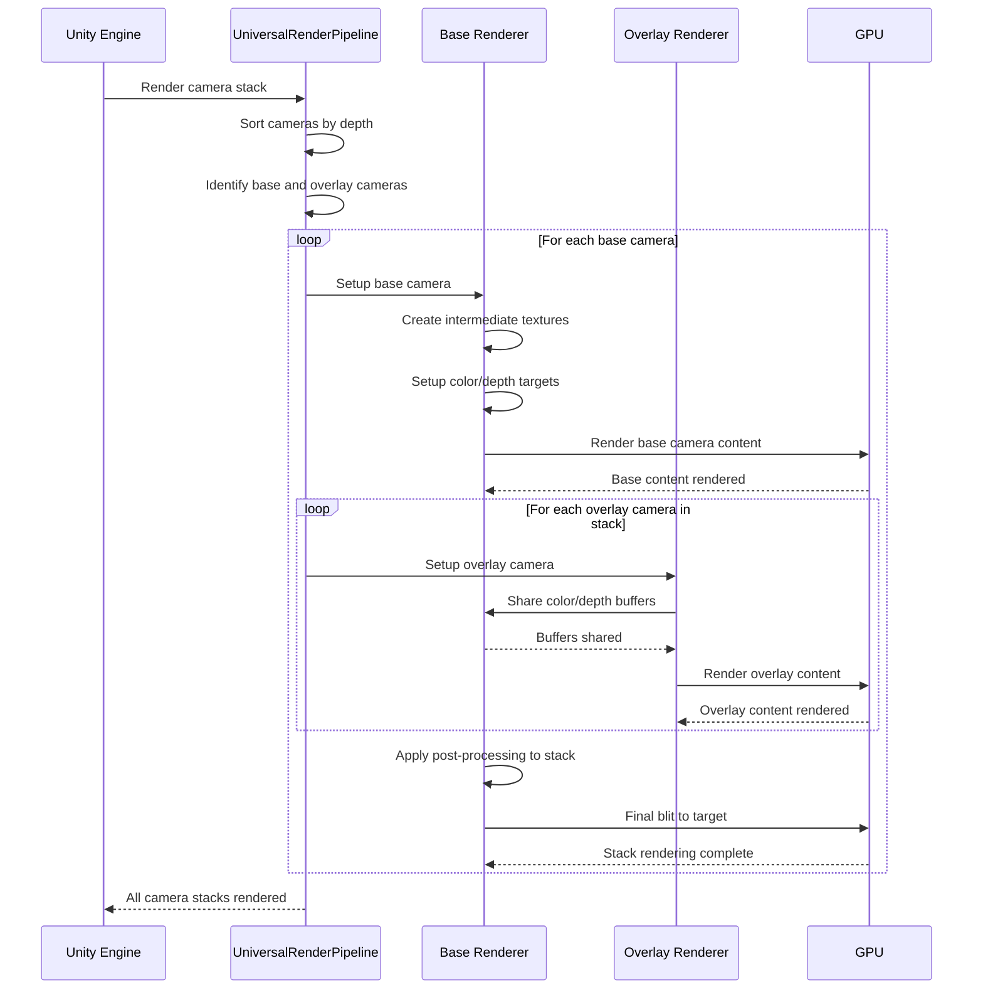

# Unity URP - Execution Flow Diagrams

## 1. Complete Frame Rendering Flow



## 2. Forward Rendering Mode Flow



## 3. Deferred Rendering Mode Flow

```mermaid
flowchart TD
    Start([Start Deferred Rendering]) --> Setup[Setup Camera & G-Buffer]
    Setup --> ShadowSetup{Shadow Setup Required?}
    
    ShadowSetup -->|Yes| MainShadow[Main Light Shadow Pass]
    ShadowSetup -->|No| GBufferSetup[Setup G-Buffer Targets]
    MainShadow --> AddShadow[Additional Lights Shadow Pass]
    AddShadow --> GBufferSetup
    
    GBufferSetup --> DepthNormal{Depth-Normal Prepass?}
    DepthNormal -->|Yes| DepthNormalPass[Depth-Normal Prepass]
    DepthNormal -->|No| GBufferPass[G-Buffer Pass]
    DepthNormalPass --> GBufferPass
    
    GBufferPass --> CopyGDepth[Copy G-Buffer Depth]
    CopyGDepth --> DeferredLighting[Deferred Lighting Pass]
    
    DeferredLighting --> StencilLights{Stencil or Clustered?}
    StencilLights -->|Stencil| DirectionalLights[Render Directional Lights]
    StencilLights -->|Clustered| ClusteredLights[Render Clustered Lights]
    
    DirectionalLights --> PointLights[Render Point Lights]
    PointLights --> SpotLights[Render Spot Lights]
    SpotLights --> ForwardOnly[Forward-Only Pass]
    
    ClusteredLights --> ForwardOnly
    
    ForwardOnly --> SkyboxCheck{Skybox Required?}
    SkyboxCheck -->|Yes| SkyboxPass[Draw Skybox Pass]
    SkyboxCheck -->|No| TransparentPass[Render Transparent Objects]
    SkyboxPass --> TransparentPass
    
    TransparentPass --> PostProcess{Post-Processing Enabled?}
    PostProcess -->|Yes| PPPass[Post-Process Pass]
    PostProcess -->|No| FinalBlit[Final Blit Pass]
    PPPass --> FinalBlit
    
    FinalBlit --> End([End Deferred Rendering])
```



## 4. Forward+ Clustering Setup Flow

```mermaid
sequenceDiagram
    participant FL as ForwardLights
    participant JS as Job System
    participant LMZ as LightMinMaxZJob
    RPM as ReflectionProbeMinMaxZJob
    participant ZB as ZBinningJob
    participant TJ as TilingJob
    participant TRE as TileRangeExpansionJob
    participant GPU as GPU Buffers
    
    FL->>FL: PreSetup(renderingData, cameraData, lightData)
    FL->>FL: Calculate tile resolution and bin count
    FL->>FL: Setup screen space parameters
    
    FL->>JS: Schedule LightMinMaxZJob
    JS->>LMZ: Execute parallel light bounds calculation
    LMZ-->>JS: Light min/max Z values
    
    FL->>JS: Schedule ReflectionProbeMinMaxZJob
    JS->>RPM: Execute parallel probe bounds calculation
    RPM-->>JS: Probe min/max Z values
    
    FL->>JS: Schedule ZBinningJob
    JS->>ZB: Execute parallel Z-binning
    ZB-->>JS: Z-bin assignments
    
    FL->>JS: Schedule TilingJob
    JS->>TJ: Execute parallel tile range calculation
    TJ-->>JS: Tile ranges per item
    
    FL->>JS: Schedule TileRangeExpansionJob
    JS->>TRE: Execute parallel tile mask generation
    TRE-->>JS: Final tile masks
    
    FL->>FL: Complete all jobs
    FL->>GPU: Upload Z-bins buffer
    FL->>GPU: Upload tile masks buffer
    FL->>GPU: Set Forward+ parameters
```

## 5. Shadow Rendering Flow

```mermaid
flowchart TD
    Start([Start Shadow Rendering]) --> LightCull[Cull Shadow Casting Lights]
    LightCull --> MainLightCheck{Main Light Shadows?}
    
    MainLightCheck -->|Yes| MainLightSetup[Setup Main Light Shadows]
    MainLightCheck -->|No| AddLightCheck{Additional Light Shadows?}
    
    MainLightSetup --> CascadeSetup[Setup Shadow Cascades]
    CascadeSetup --> CascadeLoop{For Each Cascade}
    
    CascadeLoop --> CascadeCull[Cull Shadow Casters for Cascade]
    CascadeCull --> CascadeRender[Render Shadow Map for Cascade]
    CascadeRender --> CascadeNext{More Cascades?}
    CascadeNext -->|Yes| CascadeLoop
    CascadeNext -->|No| MainLightConstants[Setup Main Light Shadow Constants]
    
    MainLightConstants --> AddLightCheck
    
    AddLightCheck -->|Yes| AddLightSetup[Setup Additional Light Shadows]
    AddLightCheck -->|No| ShadowEnd([End Shadow Rendering])
    
    AddLightSetup --> AtlasSetup[Setup Shadow Atlas Layout]
    AtlasSetup --> AtlasLoop{For Each Shadow Light}
    
    AtlasLoop --> AtlasCull[Cull Shadow Casters for Light]
    AtlasCull --> AtlasRender[Render to Atlas Tile]
    AtlasRender --> AtlasNext{More Shadow Lights?}
    AtlasNext -->|Yes| AtlasLoop
    AtlasNext -->|No| AddLightConstants[Setup Additional Light Shadow Constants]
    
    AddLightConstants --> ShadowEnd
```



## 6. Post-Processing Execution Flow



## 7. XR/VR Rendering Flow



## 8. Resource Allocation and Management Flow



## 9. Debug and Profiling Flow



## 10. Camera Stacking Flow



These execution flow diagrams provide detailed insights into how Unity URP processes rendering operations, from high-level frame orchestration down to specific subsystem execution patterns. Each diagram shows the temporal relationships and decision points that drive the rendering pipeline's behavior.