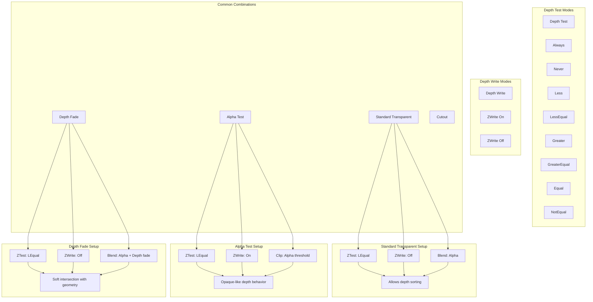

# Unity URP - Transparency Handling Diagrams

## 1. Complete Transparency Rendering Pipeline

## 2. Transparency Sorting and Rendering Order

## 3. Transparent Material Blend Modes

## 4. Transparent Shadow Receiving System

## 5. Alpha-to-Coverage (A2C) Implementation

## 6. Transparent Object Culling and Batching

## 7. Depth Buffer Interaction Modes

## 8. Transparent Lighting Integration

## 9. Transparency Performance Optimization Strategies

## 10. Transparency Quality vs Performance Trade-offs

## 11. Transparency Shader Architecture

This comprehensive transparency handling diagram shows how Unity URP manages one of the most complex aspects of real-time rendering. The system handles multiple blend modes, sorting strategies, lighting integration, and performance optimizations while maintaining visual quality across different platforms and rendering modes.