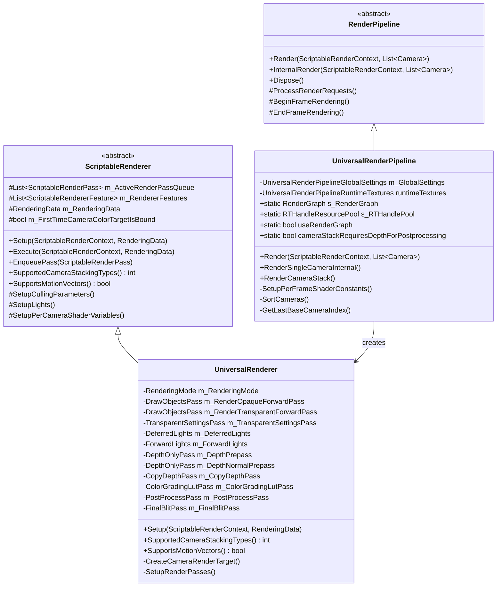
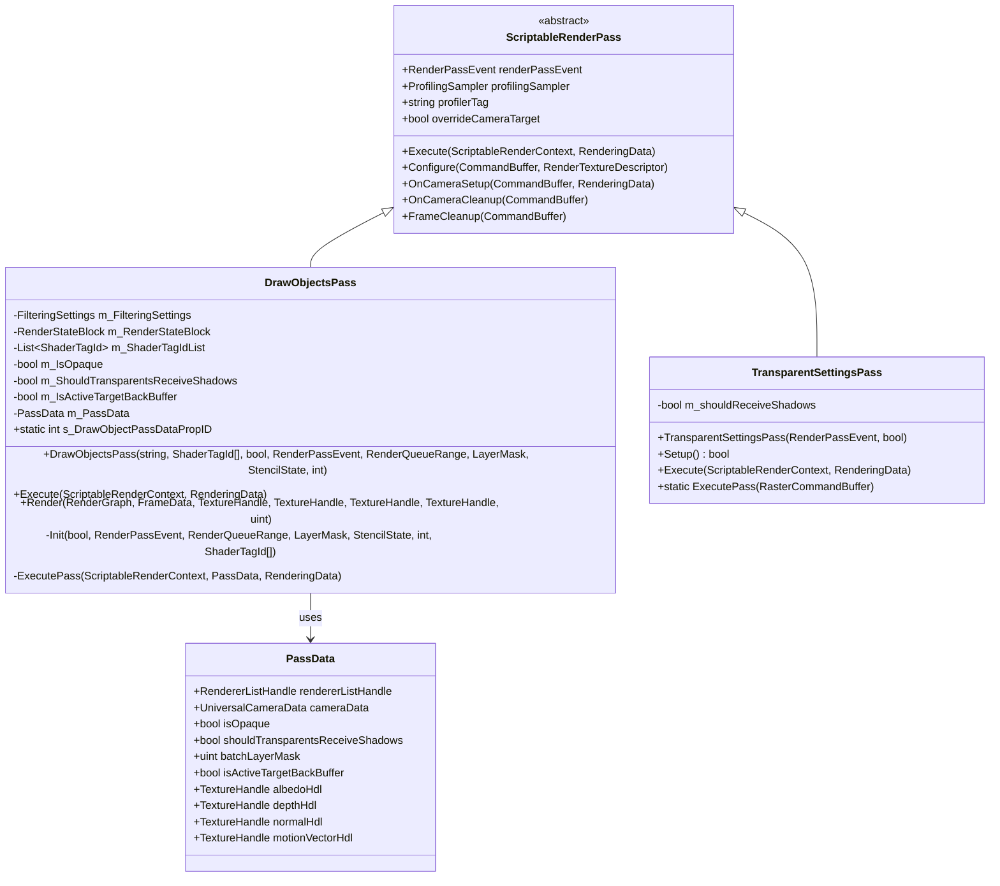
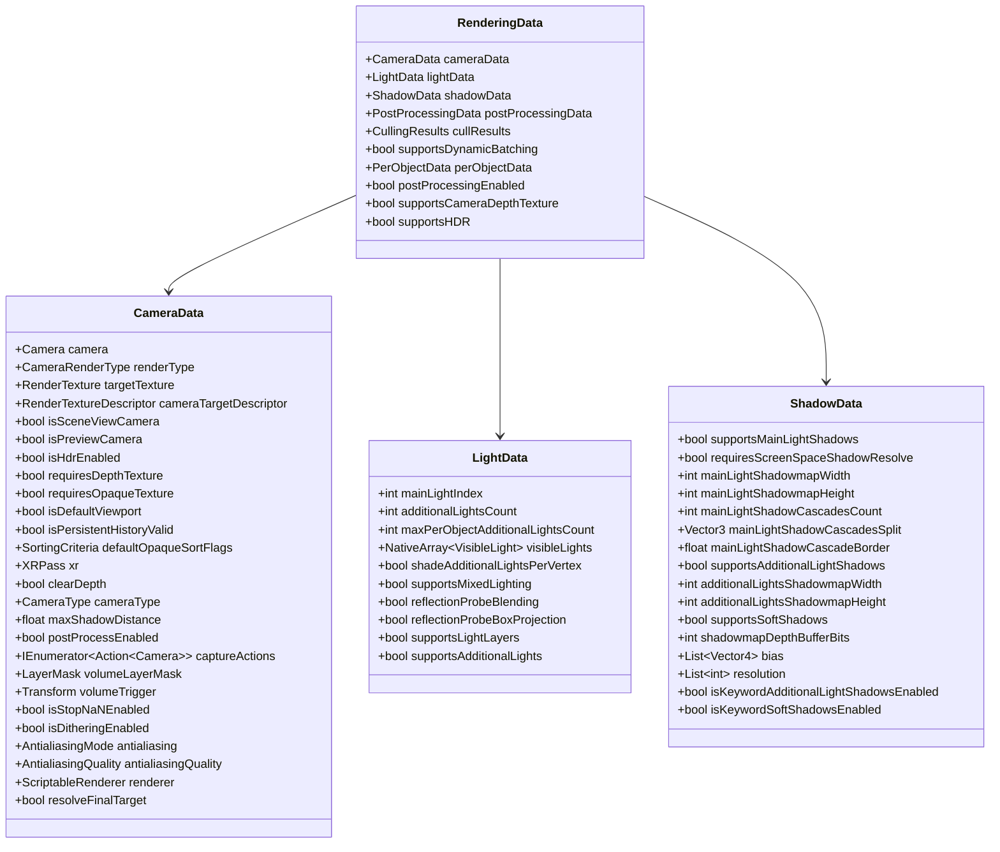

# Unity URP Class Diagrams

## 1. Core Class Hierarchy

```mermaid
classDiagram
    class RenderPipeline {
        <<abstract>>
        +Render(ScriptableRenderContext, List~Camera~)
        +InternalRender(ScriptableRenderContext, List~Camera~)
        +Dispose()
        #ProcessRenderRequests()
        #BeginFrameRendering()
        #EndFrameRendering()
    }
    
    class UniversalRenderPipeline {
        -UniversalRenderPipelineGlobalSettings m_GlobalSettings
        -UniversalRenderPipelineRuntimeTextures runtimeTextures
        +static RenderGraph s_RenderGraph
        +static RTHandleResourcePool s_RTHandlePool
        +static bool useRenderGraph
        +static bool cameraStackRequiresDepthForPostprocessing
        +Render(ScriptableRenderContext, List~Camera~)
        +RenderSingleCameraInternal()
        +RenderCameraStack()
        -SetupPerFrameShaderConstants()
        -SortCameras()
        -GetLastBaseCameraIndex()
    }
    
    class ScriptableRenderer {
        <<abstract>>
        #List~ScriptableRenderPass~ m_ActiveRenderPassQueue
        #List~ScriptableRendererFeature~ m_RendererFeatures
        #RenderingData m_RenderingData
        #bool m_FirstTimeCameraColorTargetIsBound
        +Setup(ScriptableRenderContext, RenderingData)
        +Execute(ScriptableRenderContext, RenderingData)
        +EnqueuePass(ScriptableRenderPass)
        +SupportedCameraStackingTypes() int
        +SupportsMotionVectors() bool
        #SetupCullingParameters()
        #SetupLights()
        #SetupPerCameraShaderVariables()
    }
    
    class UniversalRenderer {
        -RenderingMode m_RenderingMode
        -DrawObjectsPass m_RenderOpaqueForwardPass
        -DrawObjectsPass m_RenderTransparentForwardPass
        -TransparentSettingsPass m_TransparentSettingsPass
        -DeferredLights m_DeferredLights
        -ForwardLights m_ForwardLights
        -DepthOnlyPass m_DepthPrepass
        -DepthOnlyPass m_DepthNormalPrepass
        -CopyDepthPass m_CopyDepthPass
        -ColorGradingLutPass m_ColorGradingLutPass
        -PostProcessPass m_PostProcessPass
        -FinalBlitPass m_FinalBlitPass
        +Setup(ScriptableRenderContext, RenderingData)
        +SupportedCameraStackingTypes() int
        +SupportsMotionVectors() bool
        -CreateCameraRenderTarget()
        -SetupRenderPasses()
    }
    
    RenderPipeline <|-- UniversalRenderPipeline
    ScriptableRenderer <|-- UniversalRenderer
    UniversalRenderPipeline --> UniversalRenderer : creates
```

## 2. Transparency Pass Classes

```mermaid
classDiagram
    class ScriptableRenderPass {
        <<abstract>>
        +RenderPassEvent renderPassEvent
        +ProfilingSampler profilingSampler
        +string profilerTag
        +bool overrideCameraTarget
        +Execute(ScriptableRenderContext, RenderingData)
        +Configure(CommandBuffer, RenderTextureDescriptor)
        +OnCameraSetup(CommandBuffer, RenderingData)
        +OnCameraCleanup(CommandBuffer)
        +FrameCleanup(CommandBuffer)
    }
    
    class DrawObjectsPass {
        -FilteringSettings m_FilteringSettings
        -RenderStateBlock m_RenderStateBlock
        -List~ShaderTagId~ m_ShaderTagIdList
        -bool m_IsOpaque
        -bool m_ShouldTransparentsReceiveShadows
        -bool m_IsActiveTargetBackBuffer
        -PassData m_PassData
        +static int s_DrawObjectPassDataPropID
        +DrawObjectsPass(string, ShaderTagId[], bool, RenderPassEvent, RenderQueueRange, LayerMask, StencilState, int)
        +Execute(ScriptableRenderContext, RenderingData)
        +Render(RenderGraph, FrameData, TextureHandle, TextureHandle, TextureHandle, TextureHandle, uint)
        -Init(bool, RenderPassEvent, RenderQueueRange, LayerMask, StencilState, int, ShaderTagId[])
        -ExecutePass(ScriptableRenderContext, PassData, RenderingData)
    }
    
    class TransparentSettingsPass {
        -bool m_shouldReceiveShadows
        +TransparentSettingsPass(RenderPassEvent, bool)
        +Setup() bool
        +Execute(ScriptableRenderContext, RenderingData)
        +static ExecutePass(RasterCommandBuffer)
    }
    
    class PassData {
        +RendererListHandle rendererListHandle
        +UniversalCameraData cameraData
        +bool isOpaque
        +bool shouldTransparentsReceiveShadows
        +uint batchLayerMask
        +bool isActiveTargetBackBuffer
        +TextureHandle albedoHdl
        +TextureHandle depthHdl
        +TextureHandle normalHdl
        +TextureHandle motionVectorHdl
    }
    
    ScriptableRenderPass <|-- DrawObjectsPass
    ScriptableRenderPass <|-- TransparentSettingsPass
    DrawObjectsPass --> PassData : uses
```

## 3. Data Structures

```mermaid
classDiagram
    class RenderingData {
        +CameraData cameraData
        +LightData lightData
        +ShadowData shadowData
        +PostProcessingData postProcessingData
        +CullingResults cullResults
        +bool supportsDynamicBatching
        +PerObjectData perObjectData
        +bool postProcessingEnabled
        +bool supportsCameraDepthTexture
        +bool supportsHDR
    }
    
    class CameraData {
        +Camera camera
        +CameraRenderType renderType
        +RenderTexture targetTexture
        +RenderTextureDescriptor cameraTargetDescriptor
        +bool isSceneViewCamera
        +bool isPreviewCamera
        +bool isHdrEnabled
        +bool requiresDepthTexture
        +bool requiresOpaqueTexture
        +bool isDefaultViewport
        +bool isPersistentHistoryValid
        +SortingCriteria defaultOpaqueSortFlags
        +XRPass xr
        +bool clearDepth
        +CameraType cameraType
        +float maxShadowDistance
        +bool postProcessEnabled
        +IEnumerator~Action~Camera~~ captureActions
        +LayerMask volumeLayerMask
        +Transform volumeTrigger
        +bool isStopNaNEnabled
        +bool isDitheringEnabled
        +AntialiasingMode antialiasing
        +AntialiasingQuality antialiasingQuality
        +ScriptableRenderer renderer
        +bool resolveFinalTarget
    }
    
    class LightData {
        +int mainLightIndex
        +int additionalLightsCount
        +int maxPerObjectAdditionalLightsCount
        +NativeArray~VisibleLight~ visibleLights
        +bool shadeAdditionalLightsPerVertex
        +bool supportsMixedLighting
        +bool reflectionProbeBlending
        +bool reflectionProbeBoxProjection
        +bool supportsLightLayers
        +bool supportsAdditionalLights
    }
    
    class ShadowData {
        +bool supportsMainLightShadows
        +bool requiresScreenSpaceShadowResolve
        +int mainLightShadowmapWidth
        +int mainLightShadowmapHeight
        +int mainLightShadowCascadesCount
        +Vector3 mainLightShadowCascadesSplit
        +float mainLightShadowCascadeBorder
        +bool supportsAdditionalLightShadows
        +int additionalLightsShadowmapWidth
        +int additionalLightsShadowmapHeight
        +bool supportsSoftShadows
        +int shadowmapDepthBufferBits
        +List~Vector4~ bias
        +List~int~ resolution
        +bool isKeywordAdditionalLightShadowsEnabled
        +bool isKeywordSoftShadowsEnabled
    }
    
    RenderingData --> CameraData
    RenderingData --> LightData
    RenderingData --> ShadowData
```
