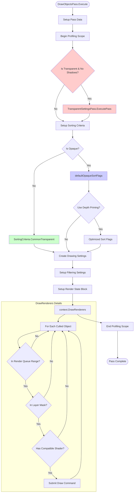
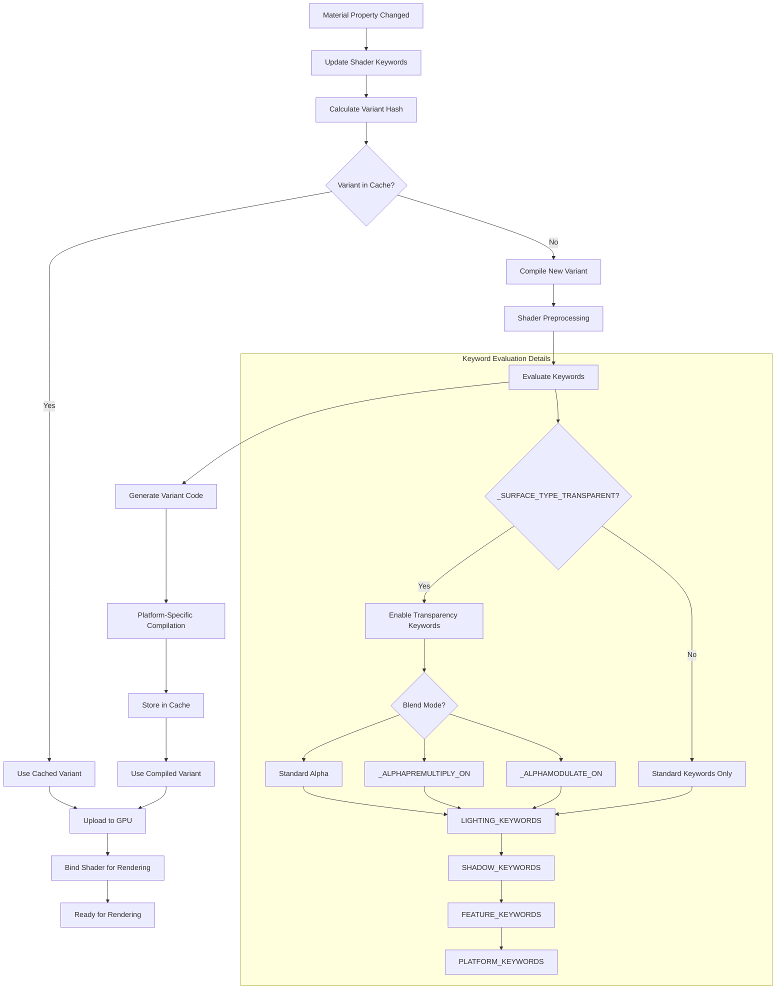
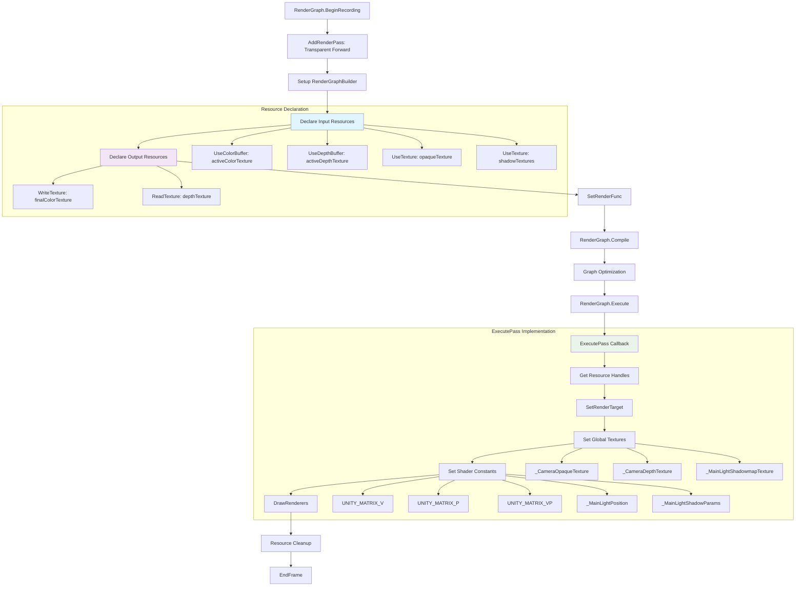

# Unity URP Detailed Implementation Diagrams

## 1. DrawObjectsPass Internal Flow



## 2. Shader Compilation and Variant Selection



## 3. RenderGraph Transparency Pass Implementation



## 4. Alpha Blending Pipeline Detail

```mermaid
flowchart TD
    FRAG_SHADER[Fragment Shader Output] --> ALPHA_TEST{Alpha Test Enabled?}
    
    ALPHA_TEST -->|Yes| CLIP_CHECK{alpha < _Cutoff?}
    ALPHA_TEST -->|No| BLEND_SETUP
    
    CLIP_CHECK -->|Yes| DISCARD[discard fragment]
    CLIP_CHECK -->|No| BLEND_SETUP
    
    BLEND_SETUP[Setup Blend Operation] --> BLEND_MODE{Blend Mode}
    
    BLEND_MODE --> ALPHA_BLEND[Standard Alpha]
    BLEND_MODE --> PREMUL_BLEND[Premultiplied Alpha]
    BLEND_MODE --> ADD_BLEND[Additive]
    BLEND_MODE --> MUL_BLEND[Multiply]
    
    subgraph "Standard Alpha Blending"
        ALPHA_BLEND --> ALPHA_EQ[Result = Src*SrcAlpha + Dst*(1-SrcAlpha)]
        ALPHA_EQ --> ALPHA_RESULT[Final Color]
    end
    
    subgraph "Premultiplied Alpha Blending"
        PREMUL_BLEND --> PREMUL_EQ[Result = Src + Dst*(1-SrcAlpha)]
        PREMUL_EQ --> PREMUL_RESULT[Final Color]
    end
    
    subgraph "Additive Blending"
        ADD_BLEND --> ADD_EQ[Result = Src*SrcAlpha + Dst]
        ADD_EQ --> ADD_RESULT[Final Color]
    end
    
    subgraph "Multiply Blending"
        MUL_BLEND --> MUL_EQ[Result = Src*DstColor]
        MUL_EQ --> MUL_RESULT[Final Color]
    end
    
    ALPHA_RESULT --> WRITE_FB[Write to Framebuffer]
    PREMUL_RESULT --> WRITE_FB
    ADD_RESULT --> WRITE_FB
    MUL_RESULT --> WRITE_FB
    
    WRITE_FB --> DEPTH_TEST{Depth Test}
    DEPTH_TEST -->|Pass| DEPTH_WRITE{Depth Write Enabled?}
    DEPTH_TEST -->|Fail| DISCARD
    
    DEPTH_WRITE -->|Yes| UPDATE_DEPTH[Update Depth Buffer]
    DEPTH_WRITE -->|No| NEXT_FRAGMENT
    
    UPDATE_DEPTH --> NEXT_FRAGMENT[Process Next Fragment]
    DISCARD --> NEXT_FRAGMENT
    
    style ALPHA_TEST fill:#fff3e0
    style CLIP_CHECK fill:#ffebee
    style BLEND_MODE fill:#e8f5e8
    style DEPTH_TEST fill:#e3f2fd
```

## 5. Shadow Handling for Transparency

```mermaid
flowchart TD
    TRANS_SETUP[Transparent Settings Pass] --> SHADOW_SETTING{Receive Shadows?}
    
    SHADOW_SETTING -->|No| DISABLE_MAIN[Disable Main Light Shadows]
    SHADOW_SETTING -->|Yes| ENABLE_SHADOWS[Enable Shadow Sampling]
    
    DISABLE_MAIN --> DISABLE_ADD[Disable Additional Light Shadows]
    DISABLE_ADD --> SET_EMPTY_PARAMS[Set Empty Shadow Parameters]
    
    SET_EMPTY_PARAMS --> MAIN_SHADOW_PARAMS[_MainLightShadowParams = (0,0,0,-1)]
    SET_EMPTY_PARAMS --> ADD_SHADOW_PARAMS[_AdditionalLightsShadowParams = (0,0,0,-1)]
    SET_EMPTY_PARAMS --> SHADOW_MATRIX[_MainLightWorldToShadow = Identity]
    
    ENABLE_SHADOWS --> SETUP_MAIN[Setup Main Light Shadows]
    SETUP_MAIN --> SETUP_ADD[Setup Additional Light Shadows]
    
    subgraph "Main Light Shadow Setup"
        SETUP_MAIN --> MAIN_SHADOW_MAP[Bind Main Shadow Map]
        MAIN_SHADOW_MAP --> MAIN_MATRIX[Setup Shadow Matrix]
        MAIN_MATRIX --> MAIN_PARAMS[Set Shadow Parameters]
        MAIN_PARAMS --> CASCADE_SETUP[Setup Cascade Data]
    end
    
    subgraph "Additional Light Shadow Setup"
        SETUP_ADD --> ADD_SHADOW_MAP[Bind Additional Shadow Maps]
        ADD_SHADOW_MAP --> ADD_MATRICES[Setup Shadow Matrices]
        ADD_MATRICES --> ADD_PARAMS[Set Shadow Parameters]
        ADD_PARAMS --> ATLAS_SETUP[Setup Shadow Atlas]
    end
    
    CASCADE_SETUP --> SHADER_CONSTANTS
    ATLAS_SETUP --> SHADER_CONSTANTS
    MAIN_SHADOW_PARAMS --> SHADER_CONSTANTS
    ADD_SHADOW_PARAMS --> SHADER_CONSTANTS
    SHADOW_MATRIX --> SHADER_CONSTANTS
    
    SHADER_CONSTANTS[Upload Shader Constants] --> TRANS_RENDER[Transparent Rendering]
    
    subgraph "Fragment Shader Shadow Sampling"
        TRANS_RENDER --> SAMPLE_SHADOWS{Sample Shadows?}
        SAMPLE_SHADOWS -->|No| NO_SHADOW[shadowAttenuation = 1.0]
        SAMPLE_SHADOWS -->|Yes| CALC_SHADOW_COORD[Calculate Shadow Coordinates]
        
        CALC_SHADOW_COORD --> SAMPLE_MAIN[Sample Main Light Shadow]
        SAMPLE_MAIN --> SAMPLE_ADD[Sample Additional Light Shadows]
        SAMPLE_ADD --> COMBINE_ATTEN[Combine Attenuation]
        
        NO_SHADOW --> APPLY_LIGHTING
        COMBINE_ATTEN --> APPLY_LIGHTING[Apply Lighting with Shadows]
    end
    
    APPLY_LIGHTING --> FINAL_COLOR[Final Fragment Color]
    
    style SHADOW_SETTING fill:#fff3e0
    style DISABLE_MAIN fill:#ffebee
    style ENABLE_SHADOWS fill:#e8f5e8
    style SAMPLE_SHADOWS fill:#e3f2fd
```
