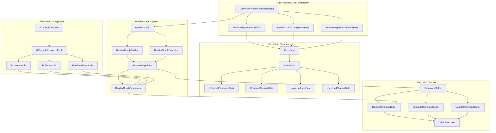
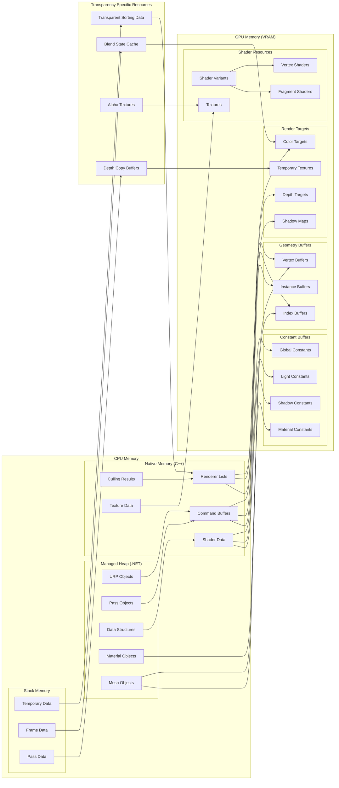
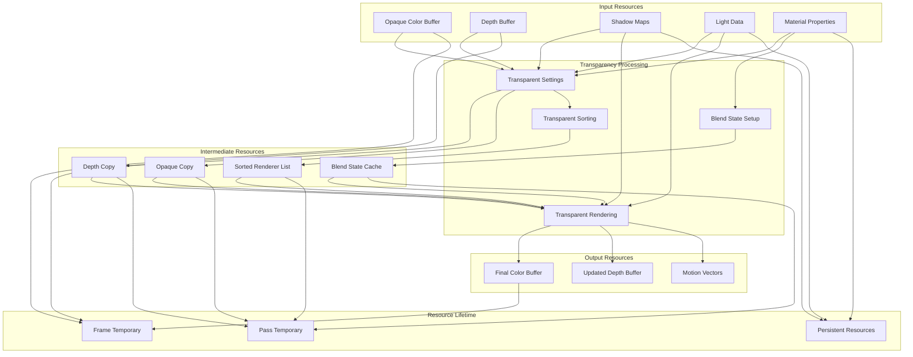

# Unity URP Resource and Memory Diagrams

## 1. Shader Variant System Architecture

```mermaid
graph TB
    subgraph "Shader Compilation System"
        SC[Shader Compiler]
        SV[Shader Variants]
        SK[Shader Keywords]
        SDB[Shader Database]
    end
    
    subgraph "Transparency Variants"
        ST[_SURFACE_TYPE_TRANSPARENT]
        AT[_ALPHATEST_ON]
        AP[_ALPHAPREMULTIPLY_ON]
        AM[_ALPHAMODULATE_ON]
    end
    
    subgraph "Lighting Variants"
        MLS[_MAIN_LIGHT_SHADOWS]
        MLSC[_MAIN_LIGHT_SHADOWS_CASCADE]
        ALS[_ADDITIONAL_LIGHT_SHADOWS]
        ALV[_ADDITIONAL_LIGHTS_VERTEX]
        AL[_ADDITIONAL_LIGHTS]
    end
    
    subgraph "Feature Variants"
        RPB[_REFLECTION_PROBE_BLENDING]
        SS[_SHADOWS_SOFT]
        SSAO[_SCREEN_SPACE_OCCLUSION]
        FOG[FOG_LINEAR/FOG_EXP/FOG_EXP2]
        LIGHTMAP[LIGHTMAP_ON]
        DIRLIGHTMAP[DIRLIGHTMAP_COMBINED]
    end
    
    subgraph "Platform Variants"
        INST[INSTANCING_ON]
        DOTS[DOTS_INSTANCING_ON]
        XR[XR_RENDERING]
        FP[_FORWARD_PLUS]
        CLUSTERED[_CLUSTERED_RENDERING]
    end
    
    SC --> SV
    SV --> SK
    SK --> SDB
    
    SK --> ST
    SK --> AT
    SK --> AP
    SK --> AM
    
    SK --> MLS
    SK --> MLSC
    SK --> ALS
    SK --> ALV
    SK --> AL
    
    SK --> RPB
    SK --> SS
    SK --> SSAO
    SK --> FOG
    SK --> LIGHTMAP
    SK --> DIRLIGHTMAP
    
    SK --> INST
    SK --> DOTS
    SK --> XR
    SK --> FP
    SK --> CLUSTERED
    
    subgraph "Runtime Selection"
        MS[Material Settings]
        QS[Quality Settings]
        PS[Platform Settings]
        CS[Camera Settings]
        LS_SET[Lighting Settings]
    end
    
    MS --> ST
    MS --> AT
    MS --> AP
    MS --> AM
    
    QS --> SS
    QS --> SSAO
    QS --> FOG
    
    PS --> INST
    PS --> DOTS
    PS --> XR
    
    CS --> MLS
    CS --> ALS
    
    LS_SET --> LIGHTMAP
    LS_SET --> DIRLIGHTMAP
```

## 2. RenderGraph Integration Architecture

## 3. Memory Layout and Resource Flow

## 4. Transparency Resource Dependencies

