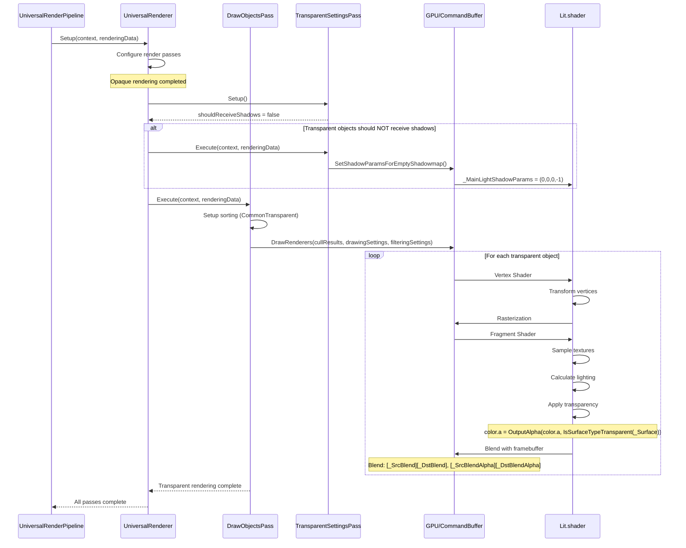
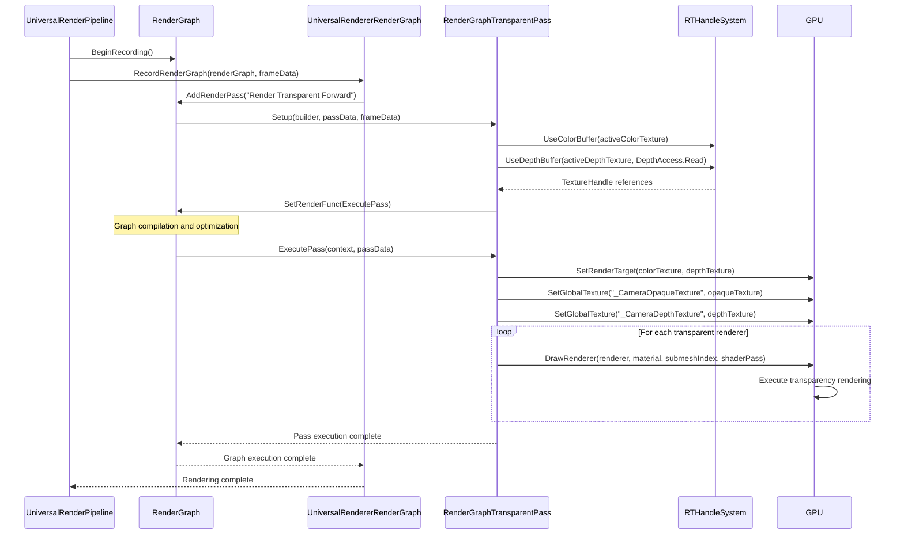
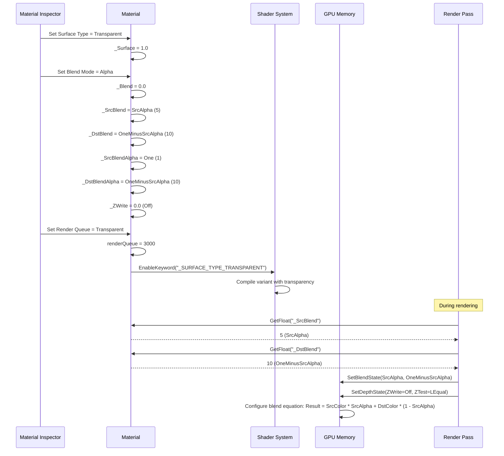

# Unity URP Sequence Diagrams

## 1. Transparency Pass Data Flow

```mermaid
sequenceDiagram
    participant URP as UniversalRenderPipeline
    participant UR as UniversalRenderer
    participant DOP as DrawObjectsPass
    participant TSP as TransparentSettingsPass
    participant GPU as GPU/CommandBuffer
    participant Shader as Lit.shader
    
    URP->>UR: Setup(context, renderingData)
    UR->>UR: Configure render passes
    
    Note over UR: Opaque rendering completed
    
    UR->>TSP: Setup()
    TSP-->>UR: shouldReceiveShadows = false
    
    alt Transparent objects should NOT receive shadows
        UR->>TSP: Execute(context, renderingData)
        TSP->>GPU: SetShadowParamsForEmptyShadowmap()
        GPU->>Shader: _MainLightShadowParams = (0,0,0,-1)
    end
    
    UR->>DOP: Execute(context, renderingData)
    DOP->>DOP: Setup sorting (CommonTransparent)
    DOP->>GPU: DrawRenderers(cullResults, drawingSettings, filteringSettings)
    
    loop For each transparent object
        GPU->>Shader: Vertex Shader
        Shader->>Shader: Transform vertices
        Shader->>GPU: Rasterization
        GPU->>Shader: Fragment Shader
        Shader->>Shader: Sample textures
        Shader->>Shader: Calculate lighting
        Shader->>Shader: Apply transparency
        Note over Shader: color.a = OutputAlpha(color.a, IsSurfaceTypeTransparent(_Surface))
        Shader->>GPU: Blend with framebuffer
        Note over GPU: Blend: [_SrcBlend][_DstBlend], [_SrcBlendAlpha][_DstBlendAlpha]
    end
    
    DOP-->>UR: Transparent rendering complete
    UR-->>URP: All passes complete
```

## 2. RenderGraph Transparency Flow

```mermaid
sequenceDiagram
    participant URP as UniversalRenderPipeline
    participant RG as RenderGraph
    participant URRG as UniversalRendererRenderGraph
    participant RGTP as RenderGraphTransparentPass
    participant RTH as RTHandleSystem
    participant GPU as GPU
    
    URP->>RG: BeginRecording()
    URP->>URRG: RecordRenderGraph(renderGraph, frameData)
    
    URRG->>RG: AddRenderPass("Render Transparent Forward")
    RG->>RGTP: Setup(builder, passData, frameData)
    
    RGTP->>RTH: UseColorBuffer(activeColorTexture)
    RGTP->>RTH: UseDepthBuffer(activeDepthTexture, DepthAccess.Read)
    RTH-->>RGTP: TextureHandle references
    
    RGTP->>RG: SetRenderFunc(ExecutePass)
    
    Note over RG: Graph compilation and optimization
    
    RG->>RGTP: ExecutePass(context, passData)
    RGTP->>GPU: SetRenderTarget(colorTexture, depthTexture)
    RGTP->>GPU: SetGlobalTexture("_CameraOpaqueTexture", opaqueTexture)
    RGTP->>GPU: SetGlobalTexture("_CameraDepthTexture", depthTexture)
    
    loop For each transparent renderer
        RGTP->>GPU: DrawRenderer(renderer, material, submeshIndex, shaderPass)
        GPU->>GPU: Execute transparency rendering
    end
    
    RGTP-->>RG: Pass execution complete
    RG-->>URRG: Graph execution complete
    URRG-->>URP: Rendering complete
```

## 3. Material Property Update Flow

```mermaid
sequenceDiagram
    participant UI as Material Inspector
    participant Mat as Material
    participant Shader as Shader System
    participant GPU as GPU Memory
    participant Pass as Render Pass
    
    UI->>Mat: Set Surface Type = Transparent
    Mat->>Mat: _Surface = 1.0
    
    UI->>Mat: Set Blend Mode = Alpha
    Mat->>Mat: _Blend = 0.0
    Mat->>Mat: _SrcBlend = SrcAlpha (5)
    Mat->>Mat: _DstBlend = OneMinusSrcAlpha (10)
    Mat->>Mat: _SrcBlendAlpha = One (1)
    Mat->>Mat: _DstBlendAlpha = OneMinusSrcAlpha (10)
    Mat->>Mat: _ZWrite = 0.0 (Off)
    
    UI->>Mat: Set Render Queue = Transparent
    Mat->>Mat: renderQueue = 3000
    
    Mat->>Shader: EnableKeyword("_SURFACE_TYPE_TRANSPARENT")
    Shader->>Shader: Compile variant with transparency
    
    Note over Pass: During rendering
    Pass->>Mat: GetFloat("_SrcBlend")
    Mat-->>Pass: 5 (SrcAlpha)
    Pass->>Mat: GetFloat("_DstBlend")
    Mat-->>Pass: 10 (OneMinusSrcAlpha)
    
    Pass->>GPU: SetBlendState(SrcAlpha, OneMinusSrcAlpha)
    Pass->>GPU: SetDepthState(ZWrite=Off, ZTest=LEqual)
    
    GPU->>GPU: Configure blend equation: Result = SrcColor * SrcAlpha + DstColor * (1 - SrcAlpha)
```
