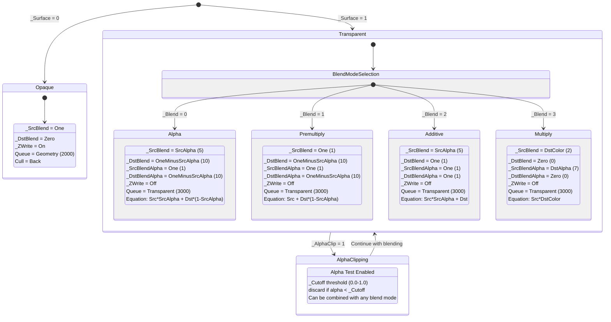
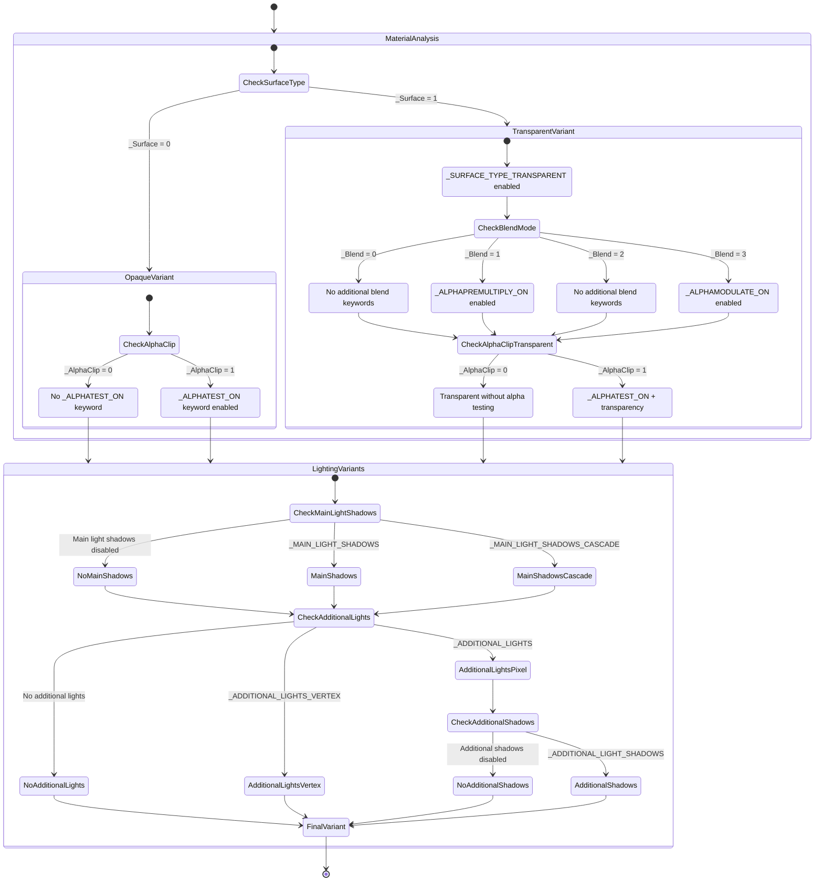

# Unity URP State Diagrams

## 1. Blend Mode State Machine

```mermaid
stateDiagram-v2
    [*] --> Opaque : _Surface = 0
    [*] --> Transparent : _Surface = 1
    
    state Opaque {
        [*] --> OpaqueState
        OpaqueState : _SrcBlend = One
        OpaqueState : _DstBlend = Zero
        OpaqueState : _ZWrite = On
        OpaqueState : Queue = Geometry (2000)
        OpaqueState : Cull = Back
    }
    
    state Transparent {
        [*] --> BlendModeSelection
        
        state BlendModeSelection {
            [*] --> Alpha : _Blend = 0
            [*] --> Premultiply : _Blend = 1
            [*] --> Additive : _Blend = 2
            [*] --> Multiply : _Blend = 3
        }
        
        state Alpha {
            AlphaState : _SrcBlend = SrcAlpha (5)
            AlphaState : _DstBlend = OneMinusSrcAlpha (10)
            AlphaState : _SrcBlendAlpha = One (1)
            AlphaState : _DstBlendAlpha = OneMinusSrcAlpha (10)
            AlphaState : _ZWrite = Off
            AlphaState : Queue = Transparent (3000)
            AlphaState : Equation: Src*SrcAlpha + Dst*(1-SrcAlpha)
        }
        
        state Premultiply {
            PremultiplyState : _SrcBlend = One (1)
            PremultiplyState : _DstBlend = OneMinusSrcAlpha (10)
            PremultiplyState : _SrcBlendAlpha = One (1)
            PremultiplyState : _DstBlendAlpha = OneMinusSrcAlpha (10)
            PremultiplyState : _ZWrite = Off
            PremultiplyState : Queue = Transparent (3000)
            PremultiplyState : Equation: Src + Dst*(1-SrcAlpha)
        }
        
        state Additive {
            AdditiveState : _SrcBlend = SrcAlpha (5)
            AdditiveState : _DstBlend = One (1)
            AdditiveState : _SrcBlendAlpha = One (1)
            AdditiveState : _DstBlendAlpha = One (1)
            AdditiveState : _ZWrite = Off
            AdditiveState : Queue = Transparent (3000)
            AdditiveState : Equation: Src*SrcAlpha + Dst
        }
        
        state Multiply {
            MultiplyState : _SrcBlend = DstColor (2)
            MultiplyState : _DstBlend = Zero (0)
            MultiplyState : _SrcBlendAlpha = DstAlpha (7)
            MultiplyState : _DstBlendAlpha = Zero (0)
            MultiplyState : _ZWrite = Off
            MultiplyState : Queue = Transparent (3000)
            MultiplyState : Equation: Src*DstColor
        }
    }
    
    Transparent --> AlphaClipping : _AlphaClip = 1
    
    state AlphaClipping {
        ClipState : Alpha Test Enabled
        ClipState : _Cutoff threshold (0.0-1.0)
        ClipState : discard if alpha < _Cutoff
        ClipState : Can be combined with any blend mode
    }
    
    AlphaClipping --> Transparent : Continue with blending
```

## 2. Render Pass Event State Machine

```mermaid
stateDiagram-v2
    [*] --> BeforeRendering
    
    BeforeRendering --> BeforeRenderingShadows
    BeforeRenderingShadows --> AfterRenderingShadows
    AfterRenderingShadows --> BeforeRenderingPrePasses
    BeforeRenderingPrePasses --> AfterRenderingPrePasses
    AfterRenderingPrePasses --> BeforeRenderingGbuffer
    BeforeRenderingGbuffer --> AfterRenderingGbuffer
    AfterRenderingGbuffer --> BeforeRenderingDeferredLights
    BeforeRenderingDeferredLights --> AfterRenderingDeferredLights
    AfterRenderingDeferredLights --> BeforeRenderingOpaques
    BeforeRenderingOpaques --> AfterRenderingOpaques
    AfterRenderingOpaques --> BeforeRenderingSkybox
    BeforeRenderingSkybox --> AfterRenderingSkybox
    AfterRenderingSkybox --> BeforeRenderingTransparents
    
    state BeforeRenderingTransparents {
        [*] --> TransparentSetup
        TransparentSetup : Configure shadow receiving
        TransparentSetup : Setup transparent settings pass
        TransparentSetup : Prepare depth texture if needed
    }
    
    BeforeRenderingTransparents --> RenderingTransparents
    
    state RenderingTransparents {
        [*] --> SortTransparentObjects
        SortTransparentObjects --> SetupBlendState
        SetupBlendState --> RenderTransparentGeometry
        RenderTransparentGeometry --> [*]
        
        state SortTransparentObjects {
            [*] --> DistanceSort
            DistanceSort : Sort back-to-front by camera distance
            DistanceSort : Apply SortingCriteria.CommonTransparent
            DistanceSort : Consider sorting layer and render queue
        }
        
        state SetupBlendState {
            [*] --> ConfigureBlending
            ConfigureBlending : Set source/destination blend factors
            ConfigureBlending : Configure depth write state
            ConfigureBlending : Set render queue
        }
        
        state RenderTransparentGeometry {
            [*] --> ForEachTransparentObject
            ForEachTransparentObject --> ExecuteVertexShader
            ExecuteVertexShader --> Rasterization
            Rasterization --> ExecuteFragmentShader
            ExecuteFragmentShader --> AlphaBlending
            AlphaBlending --> ForEachTransparentObject
            AlphaBlending --> [*]
        }
    }
    
    RenderingTransparents --> AfterRenderingTransparents
    AfterRenderingTransparents --> BeforeRenderingPostProcessing
    BeforeRenderingPostProcessing --> AfterRenderingPostProcessing
    AfterRenderingPostProcessing --> AfterRendering
    AfterRendering --> [*]
```

## 3. Shader Variant Selection State Machine

```mermaid
stateDiagram-v2
    [*] --> MaterialAnalysis
    
    state MaterialAnalysis {
        [*] --> CheckSurfaceType
        CheckSurfaceType --> OpaqueVariant : _Surface = 0
        CheckSurfaceType --> TransparentVariant : _Surface = 1
    }
    
    state OpaqueVariant {
        [*] --> CheckAlphaClip
        CheckAlphaClip --> OpaqueNoClip : _AlphaClip = 0
        CheckAlphaClip --> OpaqueWithClip : _AlphaClip = 1
        
        OpaqueNoClip : No _ALPHATEST_ON keyword
        OpaqueWithClip : _ALPHATEST_ON keyword enabled
    }
    
    state TransparentVariant {
        [*] --> EnableTransparentKeyword
        EnableTransparentKeyword : _SURFACE_TYPE_TRANSPARENT enabled
        EnableTransparentKeyword --> CheckBlendMode
        
        CheckBlendMode --> StandardAlpha : _Blend = 0
        CheckBlendMode --> PremultipliedAlpha : _Blend = 1
        CheckBlendMode --> AdditiveBlend : _Blend = 2
        CheckBlendMode --> MultiplyBlend : _Blend = 3
        
        StandardAlpha : No additional blend keywords
        PremultipliedAlpha : _ALPHAPREMULTIPLY_ON enabled
        AdditiveBlend : No additional blend keywords
        MultiplyBlend : _ALPHAMODULATE_ON enabled
        
        StandardAlpha --> CheckAlphaClipTransparent
        PremultipliedAlpha --> CheckAlphaClipTransparent
        AdditiveBlend --> CheckAlphaClipTransparent
        MultiplyBlend --> CheckAlphaClipTransparent
        
        CheckAlphaClipTransparent --> TransparentNoClip : _AlphaClip = 0
        CheckAlphaClipTransparent --> TransparentWithClip : _AlphaClip = 1
        
        TransparentNoClip : Transparent without alpha testing
        TransparentWithClip : _ALPHATEST_ON + transparency
    }
    
    OpaqueNoClip --> LightingVariants
    OpaqueWithClip --> LightingVariants
    TransparentNoClip --> LightingVariants
    TransparentWithClip --> LightingVariants
    
    state LightingVariants {
        [*] --> CheckMainLightShadows
        CheckMainLightShadows --> NoMainShadows : Main light shadows disabled
        CheckMainLightShadows --> MainShadows : _MAIN_LIGHT_SHADOWS
        CheckMainLightShadows --> MainShadowsCascade : _MAIN_LIGHT_SHADOWS_CASCADE
        
        NoMainShadows --> CheckAdditionalLights
        MainShadows --> CheckAdditionalLights
        MainShadowsCascade --> CheckAdditionalLights
        
        CheckAdditionalLights --> NoAdditionalLights : No additional lights
        CheckAdditionalLights --> AdditionalLightsVertex : _ADDITIONAL_LIGHTS_VERTEX
        CheckAdditionalLights --> AdditionalLightsPixel : _ADDITIONAL_LIGHTS
        
        NoAdditionalLights --> FinalVariant
        AdditionalLightsVertex --> FinalVariant
        AdditionalLightsPixel --> CheckAdditionalShadows
        
        CheckAdditionalShadows --> NoAdditionalShadows : Additional shadows disabled
        CheckAdditionalShadows --> AdditionalShadows : _ADDITIONAL_LIGHT_SHADOWS
        
        NoAdditionalShadows --> FinalVariant
        AdditionalShadows --> FinalVariant
    }
    
    FinalVariant --> [*]
```
