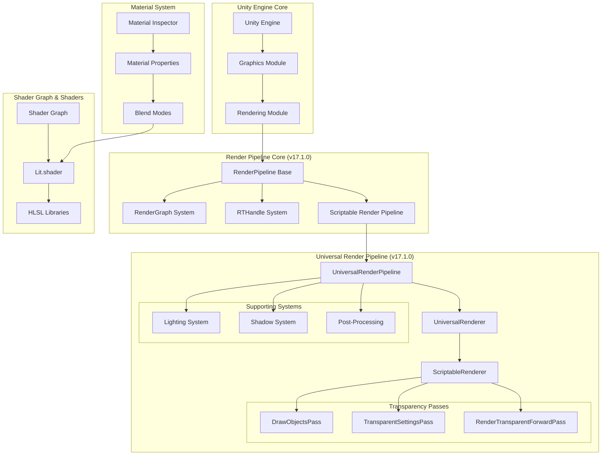
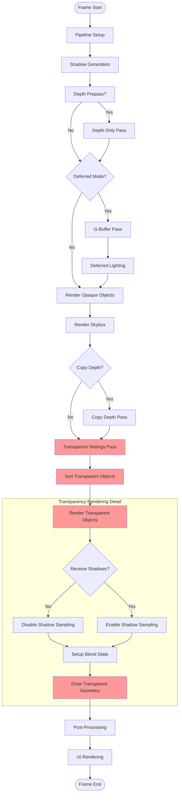

# Unity URP System Architecture Diagrams

## 1. High-Level System Architecture

```mermaid
graph TB
    subgraph "Unity Engine Core"
        UE[Unity Engine]
        GM[Graphics Module]
        RM[Rendering Module]
    end
    
    subgraph "Render Pipeline Core (v17.1.0)"
        RPC[RenderPipeline Base]
        RG[RenderGraph System]
        RTH[RTHandle System]
        SRP[Scriptable Render Pipeline]
    end
    
    subgraph "Universal Render Pipeline (v17.1.0)"
        URP[UniversalRenderPipeline]
        UR[UniversalRenderer]
        SR[ScriptableRenderer]
        
        subgraph "Transparency Passes"
            DOP[DrawObjectsPass]
            TSP[TransparentSettingsPass]
            RTP[RenderTransparentForwardPass]
        end
        
        subgraph "Supporting Systems"
            LS[Lighting System]
            SS[Shadow System]
            PS[Post-Processing]
        end
    end
    
    subgraph "Shader Graph & Shaders"
        SG[Shader Graph]
        LS_SHADER[Lit.shader]
        HLSL[HLSL Libraries]
    end
    
    subgraph "Material System"
        MS[Material Inspector]
        MP[Material Properties]
        BM[Blend Modes]
    end
    
    UE --> GM
    GM --> RM
    RM --> RPC
    RPC --> RG
    RPC --> RTH
    RPC --> SRP
    SRP --> URP
    URP --> UR
    UR --> SR
    SR --> DOP
    SR --> TSP
    SR --> RTP
    URP --> LS
    URP --> SS
    URP --> PS
    SG --> LS_SHADER
    LS_SHADER --> HLSL
    MS --> MP
    MP --> BM
    BM --> LS_SHADER
```

## 2. Transparency Rendering Pipeline Flow

```mermaid
flowchart TD
    START([Frame Start]) --> SETUP[Pipeline Setup]
    SETUP --> SHADOW[Shadow Generation]
    SHADOW --> DEPTH_PRE[Depth Prepass?]
    
    DEPTH_PRE -->|Yes| DEPTH_PASS[Depth Only Pass]
    DEPTH_PRE -->|No| GBUFFER_CHECK
    DEPTH_PASS --> GBUFFER_CHECK
    
    GBUFFER_CHECK{Deferred Mode?}
    GBUFFER_CHECK -->|Yes| GBUFFER[G-Buffer Pass]
    GBUFFER_CHECK -->|No| OPAQUE
    GBUFFER --> DEFERRED[Deferred Lighting]
    DEFERRED --> OPAQUE
    
    OPAQUE[Render Opaque Objects] --> SKYBOX[Render Skybox]
    SKYBOX --> DEPTH_COPY{Copy Depth?}
    
    DEPTH_COPY -->|Yes| COPY_DEPTH[Copy Depth Pass]
    DEPTH_COPY -->|No| TRANS_SETUP
    COPY_DEPTH --> TRANS_SETUP
    
    TRANS_SETUP[Transparent Settings Pass] --> TRANS_SORT[Sort Transparent Objects]
    TRANS_SORT --> TRANS_RENDER[Render Transparent Objects]
    
    subgraph "Transparency Rendering Detail"
        TRANS_RENDER --> SHADOW_CHECK{Receive Shadows?}
        SHADOW_CHECK -->|No| DISABLE_SHADOWS[Disable Shadow Sampling]
        SHADOW_CHECK -->|Yes| ENABLE_SHADOWS[Enable Shadow Sampling]
        DISABLE_SHADOWS --> BLEND_SETUP
        ENABLE_SHADOWS --> BLEND_SETUP
        BLEND_SETUP[Setup Blend State] --> DRAW_TRANS[Draw Transparent Geometry]
    end
    
    DRAW_TRANS --> POST[Post-Processing]
    POST --> UI[UI Rendering]
    UI --> END([Frame End])
    
    style TRANS_RENDER fill:#ff9999
    style TRANS_SORT fill:#ff9999
    style TRANS_SETUP fill:#ff9999
    style DRAW_TRANS fill:#ff9999
```
